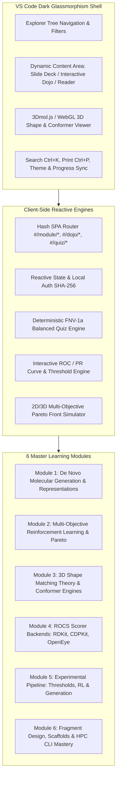

# 🧬 DrugEx Hub: Master Implementation Plan
## Interactive Onboarding, Deep API Mastery & ROCS Shape-Matching Workbench for Bachelor's Thesis

> **Thesis Topic**: *De Novo Drug Design Integrated with 3D Shape Matching (ROCS) for Flexible Targets and Intrinsically Disordered Proteins (IDPs)*  
> **Repository Baseline**: [`fulopjoz/DrugEx` (branch: `feature/rocs-scoring`)](https://github.com/fulopjoz/DrugEx/tree/feature/rocs-scoring) & [`CDDLeiden/DrugEx`](https://github.com/CDDLeiden/DrugEx)  
> **UI/UX Reference**: Python Hub (`~/build_projects/python_overview` / `newpyt.vercel.app`)  
> **Target Environment**: Windows 11 + WSL2 (Ubuntu), Vanilla ES Modules SPA, Zero Runtime Friction, Local dev server on DevPort block `34100`

---

## 🎯 Executive Summary & Thesis Context

This project builds **DrugEx Hub** — an advanced, high-density, web-based onboarding platform and interactive computational workbench. It bridges cutting-edge *de novo* molecular generation with 3D shape similarity matching (ROCS), designed specifically to support the student's bachelor thesis:

```
┌────────────────────────────────────────────────────────────────────────────────────────────────────────┐
│                                     BACHELOR THESIS CORE MISSION                                       │
├────────────────────────────────────────────────────────────────────────────────────────────────────────┤
│ 1. Deep Theoretical & Practical Mastery: Comprehensive understanding of de novo generation             │
│    (Sequence RNN, Sequence Transformer, Graph Transformer) and multi-objective reinforcement learning. │
│ 2. 3D Shape Matching (ROCS) Integration: Complete coverage of all 3 backends (RDKit, CDPKit, OpenEye),│
│    conformer generation engines, stereoisomer enumeration, and Gaussian shape alignment.              │
│ 3. Flexible Targets & IDP Paradigm: Solving the "no rigid pocket" challenge by utilizing ensemble      │
│    ligand shape queries, consensus supermolecules, and multi-objective Pareto optimization.           │
│ 4. Production Workflow & Empirical Validation: Full reproduction of the CCR2 benchmark and end-to-end  │
│    workflow ready for application to the thesis collaborator's biological target.                      │
└────────────────────────────────────────────────────────────────────────────────────────────────────────┘
```

---

## 🏗️ System Architecture & Visual Design Blueprint

DrugEx Hub adopts the aesthetic and cognitive architecture of **Python Hub** (`python_overview`), combining a dark-mode VS Code / scientific glassmorphism interface with high-density interactive tools, 3D WebGL molecular viewers, and pedagogical scaffolding.



---

## 🗺️ Master Session Breakdown (HUGE Session Steps)

The construction of DrugEx Hub is divided into **8 Major Sessions (Phases)**. Each session represents a self-contained, rigorously verified milestone that will be planned and executed in dedicated steps.

```
┌──────────────────────────────────────────────────────────────────────────────────────────────────┐
│                                 MASTER SESSION ROADMAP OVERVIEW                                  │
├─────────┬──────────────────────────────────────────────────────────────┬─────────────────────────┤
│ Session │ Focus & Deliverables                                         │ Key Capabilities        │
├─────────┼──────────────────────────────────────────────────────────────┼─────────────────────────┤
│ **S1**  │ Core Shell Scaffold, VS Code Theme & 3D WebGL Engine         │ SPA Grid, 3Dmol.js, Auth│
│ **S2**  │ Module 1: De Novo Drug Design Foundations & DrugEx Models    │ SMILES, Vocab, RNN/Trans│
│ **S3**  │ Module 2: Multi-Objective Reinforcement Learning (MORL)      │ Pareto, Desirability, SA│
│ **S4**  │ Module 3: 3D Shape Matching, IDPs & Conformer Generation     │ ETKDG, OMEGA, ConfGen   │
│ **S5**  │ Module 4: Complete ROCS Scorer Backends (RDKit, CDPKit, OE)  │ Feature Branch Deep-Dive│
│ **S6**  │ Module 5: Thesis Experimental Pipeline & Benchmark (CCR2)    │ ROC Analysis, RL Loop   │
│ **S7**  │ Module 6: Scaffold-Based Design & CLI / HPC Automation       │ BRICS, FragRL, Slurm    │
│ **S8**  │ Unified Print Engine (`Ctrl+P`), WCAG Audit & Final Polish   │ A4 PDF, Contrast Tests  │
└─────────┴──────────────────────────────────────────────────────────────┴─────────────────────────┘
```

---

### 📦 HUGE SESSION 1: Core Shell Scaffold, Glassmorphic Theme & 3D WebGL Engine
*Goal: Scaffolding the workspace, DevPort allocation, high-performance Vanilla ES Modules SPA shell, reactive state, and 3D molecular visualization capabilities.*

#### Planned Sub-Steps:
1. **Workspace & Toolchain Setup (`~/learn_projects/drugex/app`)**:
   - DevPort assignment on port block `34100` (`34100` for main dev server, `strictPort: true`).
   - Clean directory layout (`app/`, `data/`, `tools/`, `public/`, `serve.py`).
2. **VS Code Glassmorphic Dark Theme & Layout System (`app/css/shell.css`, `lecture.css`)**:
   - Dark editor token palette (`--editor: #1e1e1e`, `--sidebar: #252526`, `--accent: #38bdf8`, `--bio-green: #4ade80`, `--amber-warn: #fbbf24`).
   - Sticky header with breadcrumbs, progress tracker, command palette trigger (`Ctrl+K`), and print button (`Ctrl+P`).
   - Two-column responsive view (collapsible sidebar tree + high-density main view).
3. **SPA Router & State Management (`app/js/router.js`, `app/js/state.js`, `app/js/ui.js`)**:
   - Hash-based navigation (`#/module/:id`, `#/lecture/:id`, `#/dojo/:id`, `#/quiz/:id`, `#/thesis-guide`).
   - Salted SHA-256 local authentication, progress tracking (`Studied`, `Known`, `To-Study`), and bookmarking.
4. **3D Molecule & Conformer Visualization Engine (`app/js/viewer3d.js`)**:
   - Client-side 3Dmol.js / WebGL integration for interactive 3D conformer rendering, Gaussian shape envelopes, pharmacophore color overlays, and multi-structure alignment viewing.
   - 2D SVG chemical structure renderer (Ketcher / RDKit JS / SmilesDrawer fallback).
   - KaTeX integration for high-clarity rendering of mathematical and biophysical equations.

---

### 📦 HUGE SESSION 2: Module 1 — De Novo Molecular Generation & Representations
*Goal: Deep onboarding into molecular representations, deep learning generators, and vocabulary tokenization in DrugEx.*

#### Planned Sub-Steps:
1. **Lecture 1.1: Molecular Representations in Generative Chemistry**:
   - SMILES vs DeepSMILES vs SELFIES vs Molecular Graphs vs Fragment Bags.
   - Tokenization contracts in DrugEx: `VocSmiles`, start/end/pad tokens, stereochemistry flags (`@`, `@@`, `/`, `\`), ring closure indices (`%10`).
   - Standardizers (`SmilesStandardizer`, salts removal, neutralization, tautomer canonicalization).
2. **Lecture 1.2: Deep Learning Generative Architectures in DrugEx**:
   - **Sequence RNN** (`drugex/training/generators/sequence_rnn.py`): Multi-layer GRU/LSTM, hidden states, auto-regressive next-token probability distribution $P(x_t | x_{<t})$.
   - **Sequence Transformer** (`drugex/training/generators/sequence_transformer.py`): Self-attention mechanism, positional encodings, causally masked decoder.
   - **Graph Transformer** (`drugex/training/generators/graph_transformer.py`): Node/edge feature matrices, connectivity matrices, bond generation without valid SMILES grammatical bottlenecks.
3. **Lecture 1.3: Transfer Learning & Pre-Training vs Fine-Tuning Workflow**:
   - General chemical space pre-training (Papyrus 05.5 dataset, ~1.5M bioactive molecules).
   - Target-specific fine-tuning on known active binders (e.g. CCR2, A2AR).
   - Data preprocessing commands via `python -m drugex.dataset` and `python -m drugex.train -tm FT`.
4. **Interactive Dojo 1 & Assessment Suite**:
   - **Interactive SMILES Tokenizer & Vocabulary Matrix**: Type any SMILES string to see token decomposition, integer IDs, and one-hot matrix visualization.
   - **Generative Sampling Simulator**: Step through temperature-scaled softmax sampling ($\tau = 0.5 \dots 1.5$) to observe validity vs diversity.
   - **Balanced Active Recall Quizzes**: 40+ balanced A/B/C/D questions covering RNN/Transformer mechanics, tokenization traps, and data prep.

---

### 📦 HUGE SESSION 3: Module 2 — Multi-Objective Reinforcement Learning (MORL) & Pareto Optimality
*Goal: Mastering policy gradients, exploration-exploitation trade-offs, and multi-objective Pareto optimization in DrugEx.*

#### Planned Sub-Steps:
1. **Lecture 2.1: Multi-Objective Reinforcement Learning (MORL) in Chemical Space**:
   - The Actor-Critic / Policy-Gradient formulation (REINFORCE algorithm with baseline).
   - The Dual-Network Setup: **Agent** (policy $\pi_\theta$, tuned for exploitation) vs **Prior/Mutate** (policy $\pi_0$, fixed for exploration).
   - Exploration Rate ($\epsilon$ parameter) and mutation probability: $P(a_t) = (1 - \epsilon)\pi_\theta(a_t) + \epsilon \pi_0(a_t)$.
2. **Lecture 2.2: Environment & Multi-Objective Reward Schemes**:
   - `DrugExEnvironment` (`drugex/training/environment.py`): Scorer aggregation, threshold evaluation, and objective combination.
   - **Pareto Optimality**: Non-dominated sorting, Pareto front layers.
   - **Pareto Crowding Distance** (`drugex/training/rewards.py`, `drugex/utils/pareto.py`): Rewarding diverse solutions along the frontier to avoid mode collapse.
   - Alternative Schemes: Weighted Sum, Product, Ranking, and Geometric Mean.
3. **Lecture 2.3: Objective Scorers & Desirability Modifiers**:
   - `Property` scorer (`drugex/training/scorers/properties.py`): MW, LogP, HBD, HBA, TPSA, Rotatable Bonds, QED.
   - Synthetic Accessibility: `SAScorer` (Ertl & Schuffenhauer heuristic) and `RAScorer` (AiZynthFinder retrosynthetic accessibility).
   - Bioactivity Predictors: `QSPRpred` models (Random Forest, SVM, DNN classifiers and regressors).
   - **Modifiers** (`drugex/training/scorers/modifiers.py`): `SmoothClippedScore`, `ClippedScore`, `MinMaxScore`, `NormScore` — transforming continuous biophysical quantities into $[0, 1]$ desirability rewards.
4. **Interactive Dojo 2 & Assessment Suite**:
   - **Interactive Pareto Frontier 2D/3D Plotter**: Move sliders for 3 objectives (Bioactivity, Shape, SAScore) to dynamically view non-dominated sorting and crowding distance calculation.
   - **Desirability Modifier Sandbox**: Tune `lower_x`, `upper_x`, and clipping inflection points with live curve updates.
   - **Balanced Active Recall Quizzes**: 40+ questions on policy gradient updates, Pareto front mechanics, and modifier configurations.

---

### 📦 HUGE SESSION 4: Module 3 — 3D Shape Matching Theory, IDPs & Conformer Engines
*Goal: Understanding the physics of 3D molecular shape similarity, intrinsically disordered proteins (IDPs), and conformer generation.*

#### Planned Sub-Steps:
1. **Lecture 3.1: 3D Molecular Similarity & ROCS Theory**:
   - Why 2D fingerprints fail for scaffold-hopping and 3D spatial complementarity.
   - Gaussian Shape Overlays: Representing atoms as hard/soft Gaussian spheres, volume overlap integrals:
     $$V(A, B) = \int \rho_A(\mathbf{r})\rho_B(\mathbf{r}) d\mathbf{r}$$
   - **Shape Tanimoto**: $T_{shape} = \frac{V(A, B)}{V(A, A) + V(B, B) - V(A, B)}$.
   - **Color Tanimoto (Pharmacophores)**: Matching spatial chemical features (H-bond donors/acceptors, aromatics, cations, anions, hydrophobes).
   - **TanimotoCombo**: $T_{combo} = T_{shape} + T_{color} \in [0, 2]$.
2. **Lecture 3.2: The Flexible Target & Intrinsically Disordered Protein (IDP) Challenge**:
   - When X-ray crystallography or Cryo-EM fails: Flexible loops, conformational plasticity, and IDPs lacking rigid catalytic pockets.
   - **Ligand-Based 3D Design**: Using active ligand ensembles to define the 3D pharmacophoric consensus (Supermolecules & Reference Groups).
   - Strategy for the Bachelor Thesis: Integrating ROCS shape matching as the primary 3D guidance reward to drive de novo generation toward shape-complementary ligands.
3. **Lecture 3.3: Conformer Generation Deep-Dive (`conformer_generators.py`)**:
   - Comparison of 4 generation backends:
     1. **RDKit ETKDGv3** (`RDKitConformerGenerator`): Experimental Torsion-angle Knowledge Distance Geometry, thread-safe execution (`num_threads`), stereoisomer enumeration (`StereoEnumerationOptions`).
     2. **OpenEye OMEGA** (`OmegaConformerGenerator`): Rule-based torsion driving, GPU acceleration, OEFilter integration.
     3. **CDPKit ConfGen** (`CDPKitConformerGenerator`): Multi-conformer ensemble generation, energy windowing, RMSD pruning.
     4. **Schrodinger ConfGenX** (`SchrodingerConformerGenerator`): Macrocycle sampling, coordinate offset fixes (+0.01 z-offset for planar rings).
   - Heavy atom limits (`max_heavy_atoms`), rotatable bond cutoffs (`max_rotatable_bonds`), and stereocenter handling (`max_isomers`).
4. **Interactive Dojo 3 & Assessment Suite**:
   - **3D Conformer & Alignment Studio**: Interactively overlay 3D conformers of drug molecules, examine RMSD, and inspect color pharmacophore features.
   - **Conformer Engine Parameter Tuner**: Experiment with energy windows, maximum isomer counts, and thread allocation formulas.
   - **Balanced Active Recall Quizzes**: 40+ questions on Gaussian volume integration, IDP ligand-based strategies, and ETKDG parameters.

---

### 📦 HUGE SESSION 5: Module 4 — Complete ROCS Scorer Backends Deep-Dive (`feature/rocs-scoring`)
*Goal: Exhaustive code-level inspection, architectural breakdown, and hands-on comparison of all ROCS scorers in `fulopjoz/DrugEx`.*

#### Planned Sub-Steps:
1. **Lecture 4.1: RDKit ROCS Scorer Architecture (`drugex/training/scorers/rocs_rdkit.py`)**:
   - Line-by-line breakdown of `RDKitROCSScorer` and `_score_single_reference`.
   - Multiprocessing design: `_rdkit_worker_init`, `_score_molecule_rdkit_worker`, immutable settings sharing, and chunksize optimization.
   - SMILES deduplication (`_deduplicate_smiles`): Eliminating redundant 3D conformer calculations for duplicate samples during RL sampling.
   - Pose invariance and reference conformer auto-embedding (`_ensure_reference_conformers`).
   - Group-based scoring: Single Supermolecule (`RDKit_Supermol_TanimotoCombo`) vs Multi-Reference Aggregates (`RDKit_Aggregate_3refs_TanimotoCombo`) vs Dict-based multiple binding sites.
2. **Lecture 4.2: CDPKit ROCS Scorer Architecture (`drugex/training/scorers/rocs_cdpkit.py`)**:
   - Line-by-line breakdown of `CDPKitROCSScorer` and `CDPKitScoringWorker`.
   - `CDPL.Shape.GaussianShapeGenerator` & `PrincipalAxesAlignmentStartGenerator`.
   - Worker context encapsulation via `@dataclass CDPKitWorkerContext` avoiding global memory leaks.
   - Advantages: 100% open-source, no commercial license dependencies, fast Gaussian alignment.
3. **Lecture 4.3: OpenEye ROCS Scorer Architecture (`drugex/training/scorers/rocs_openeye.py`)**:
   - Line-by-line breakdown of `OpenEyeROCSScorer` and CLI subprocess orchestration.
   - Handling Shape Queries (`.sq` from VROCS GUI) vs SDF files.
   - Command flags: `-report one`, `-stats best`, `-nostructs`, `-scdbase`, `-chemff ImplicitMillsDean`, `-opt true`.
   - License checking (`OEChemIsLicensed()`), temporary directory management (`_managed_tmpdir()`), and GPU mode.
4. **Interactive Dojo 4 & Assessment Suite**:
   - **ROCS Scorer Code Inspector & Configurator**: Interactive Python snippet generator that creates ready-to-run scorer definitions for any combination of reference files.
   - **Backend Performance & Fidelity Matrix**: Direct contrastive comparison of RDKit vs CDPKit vs OpenEye (Execution speed, memory footprint, color force fields, licensing).
   - **Balanced Active Recall Quizzes**: 40+ questions on multiprocessing worker init, SDF parsing traps, and `.sq` query handling.

---

### 📦 HUGE SESSION 6: Module 5 — Bachelor Thesis Experimental Pipeline & Benchmark (CCR2)
*Goal: Step-by-step reproduction and mastering of the entire experimental workflow (threshold determination, RL training, molecule generation, and validation).*

#### Planned Sub-Steps:
1. **Lecture 5.1: ROCS Threshold Determination & ROC Analysis (`threshold_analysis.py`)**:
   - Why threshold calibration is non-negotiable: The balance between exploration reward and decoy penalty.
   - Scientific methodology: Scoring 75 CCR2 active ligands vs 500 DUD-E/ChEMBL decoys against reference templates (`CCR2_reference_ligands.sdf`).
   - ROC & Precision-Recall curves: Calculating AUC, Sensitivity (TPR), Specificity (1 - FPR), and Precision.
   - **Youden's Index ($J$) Optimization**:
     $$J = \text{Sensitivity} + \text{Specificity} - 1 = \text{TPR} - \text{FPR}$$
   - Optimal threshold derivation ($\text{ROCS\_THRESHOLD} \approx 0.871$ for CCR2).
   - Overlap distribution analysis and self-similarity verification.
2. **Lecture 5.2: End-to-End RL Experiment Execution (`config.py`, `prepare_models.py`, `rocs_rl_tutorial.ipynb`)**:
   - Step 1: Fine-tuning SequenceRNN on target ligands (`CCR_HUMAN_AL.tsv`) to obtain `CCR2_finetuned.pkg`.
   - Step 2: Setting up `DrugExEnvironment` with `RDKitROCSScorer` + `SmoothClippedScore(lower_x=5, upper_x=3)` on `Property('SA')`.
   - Step 3: Configuring `SequenceExplorer` (`epochs=50`, `n_samples=1000`, `epsilon=0.2`).
   - Step 4: Policy gradient training loop execution, monitoring `desired_ratio` ($>0.5$ target), average score evolution, and loss convergence.
3. **Lecture 5.3: Novel Molecule Generation, Filtering & Chemical Validation (`generate_molecules.py`)**:
   - Sampling 10,000+ candidates from the converged RL model (`CCR2_rdkit_reinforced.pkg`).
   - Filtering pipeline: Validity, uniqueness, novelty against ChEMBL/Papyrus training set, internal diversity (Tanimoto distance matrix).
   - Visualizing candidate 3D alignments against the template crystal pose in PyMOL / 3Dmol.
4. **Interactive Dojo 5 & Assessment Suite**:
   - **Live ROC Curve & Threshold Sandbox**: Upload or select active/decoy score sets, adjust threshold slider, and observe live confusion matrix ($TP, FP, TN, FN$), TPR/FPR trade-offs, and Youden's $J$.
   - **RL Training Trajectory Playback Simulator**: Step through 50 epochs of generated molecular distributions, watching the shift from random chemical space to shape-optimized clusters.
   - **Balanced Active Recall Quizzes**: 40+ questions on Youden's Index, desired ratio interpretation, and post-generation filtering.

---

### 📦 HUGE SESSION 7: Module 6 — Scaffold-Based Design, Fragmenters & CLI / HPC Automation
*Goal: Expanding to fragment-based generative design (linker design, scaffold hopping) and production HPC/Slurm cluster execution.*

#### Planned Sub-Steps:
1. **Lecture 6.1: Fragment-Based Generation & Scaffolds in DrugEx**:
   - Why fragment-based design matters: Controlling pharmacophore anchor points while exploring variable sidechains.
   - Fragmentation algorithms in `drugex/molecules/converters/fragmenters.py`: BRICS (Breaks on Retrosynthetically Interesting Chemical Substructures), Murcko scaffolds, and ring-assembly fragmentation.
   - Models: `FragSequenceExplorer` and `FragGraphExplorer`.
2. **Lecture 6.2: Command-Line Interface (CLI) & Production Automation**:
   - `python -m drugex.download`: Fetching Papyrus pretrained models and benchmark sets.
   - `python -m drugex.dataset`: Full matrix of arguments (`-b`, `-i`, `-mc`, `-o`, `-mt graph|smiles`, `-nof`, `-s`, `-sf`, `-sfe`).
   - `python -m drugex.train`: Flags for pre-training (`-tm PT`), fine-tuning (`-tm FT`), and RL (`-tm RL`, `-ag`, `-pr`, `-p`, `-ta`, `-sas`, `-e`, `-bs`, `-gpu`).
   - `python -m drugex.generate`: Automated batch generation and property scoring.
3. **Lecture 6.3: HPC Cluster Workflow & Slurm Scripts**:
   - Crafting reproducible Bash / Slurm submission scripts for GPU clusters (CUDA allocation, OpenEye license environment variables `export OE_LICENSE=...`, thread limits).
   - Checkpointing, backup folder handling (`backup_{n}`), and error recovery.
4. **Interactive Dojo 6 & Assessment Suite**:
   - **Interactive CLI Command Builder**: Visual form where selecting inputs, model type, GPU IDs, and scorers automatically generates verified, bug-free CLI commands and Slurm job scripts.
   - **BRICS Fragmentation Playground**: Paste a molecule to see synthetic cleavage points and resulting fragment synthons.
   - **Balanced Active Recall Quizzes**: 40+ questions on CLI arguments, fragment encoding formats, and GPU job optimization.

---

### 📦 HUGE SESSION 8: Unified Print Engine (`Ctrl+P`), WCAG Audit, Thesis Protocol Generator & Polish
*Goal: Implementing the two-column printable PDF study guide, thesis protocol exporter, accessibility audits, and production deployment.*

#### Planned Sub-Steps:
1. **Unified Print Engine & Thesis Study Sheet Generator (`app/css/print.css`, `Ctrl+P`)**:
   - Clean 2-column A4 printable layout for laboratory binders and thesis defense preparation.
   - Configurable color modes: Dark High-Contrast vs Light Ink-Saver (`data-code-block-color="light"`).
   - "Export Thesis Protocol" feature: Generates a ready-to-include LaTeX / Markdown computational methods section describing the exact DrugEx + ROCS pipeline, hyperparameters, and citations.
2. **Automated Verification & Quality Assurance Suite (`tools/`)**:
   - `check_contrast.mjs`: Automated WCAG 2.1 AAA color contrast test suite across all themes.
   - `quiz_stat.mjs`: Option distribution validator ensuring ~25% A / 25% B / 25% C / 25% D across all 250+ quizzes.
   - `prepare_vercel.mjs`: Static pre-rendering bundle sync tool.
3. **Self-Contained Local Server & Deployment Guide (`serve.py`, `README.md`, `AGENT.md`)**:
   - `serve.py` with zero-cache headers, automatic port binding on `34100`, and instant startup.
   - Comprehensive `README.md` showcasing features, quickstart, and thesis reference guide.
   - Developer/Agent guide in `AGENT.md` documenting architecture, schemas, and maintenance protocols.

---

## 🔬 Core Pedagogical & Scientific Matrix

To ensure maximum cognitive clarity for your bachelor thesis, every topic in DrugEx Hub uses contrastive mental models:

| Topic | Naive / 2D Mental Model | DrugEx 3D / MORL Reality | Thesis Relevance & Pitfall Remedy |
| :--- | :--- | :--- | :--- |
| **Target Binding** | Rigid lock-and-key pocket (X-ray grid docking). | Flexible target / IDP with no fixed cavity; ensemble of shape-complementary ligands. | Docking yields random scores; **ROCS 3D Shape Matching** provides physically meaningful ligand-based guidance. |
| **RL Reward** | Single scalar objective (e.g. QSAR score only). | Multi-objective Pareto frontier balancing Shape + Bioactivity + Synthetic Accessibility. | Single-objective RL creates un-synthesizable "monster" molecules; **Pareto Crowding Distance** maintains drug-likeness. |
| **Conformer Space** | 2D graph is sufficient for molecular affinity. | 3D bioactive conformation requires rotatable bond driving and stereoisomer sampling. | Ignoring stereocenters generates inactive isomers; **ETKDGv3 / OMEGA** filters unphysical conformations. |
| **Thresholding** | Arbitrary cutoff (e.g. "score $> 1.0$"). | Calibrated decision boundary via ROC analysis and Youden's Index on active/decoy sets. | Arbitrary threshold either starves the policy gradient (too high) or rewards decoys (too low). |
| **Optimization** | De novo generation from scratch. | Pretrained general generator $\rightarrow$ fine-tuned mutate network $\rightarrow$ policy gradient RL. | Pre-training provides chemical grammar; fine-tuning provides target focus; RL drives multi-parameter optimization. |

---

## 📁 Detailed Directory Structure of the Implementation

```
u:\home\kolar\learn_projects\drugex\
├── repo/                               # Cloned fulopjoz/DrugEx (feature/rocs-scoring branch)
│   ├── drugex/                         # Core Python package (training, scorers, models, data)
│   └── tutorial/advanced/rocs/         # Official ROCS RL tutorial & CCR2 benchmark scripts
├── app/                                # DrugEx Hub Web Application (Vanilla SPA)
│   ├── index.html                      # Main HTML5 entry point
│   ├── css/
│   │   ├── shell.css                   # VS Code glassmorphism dark theme & layout grids
│   │   ├── lecture.css                 # Slide decks, narrative callouts & visual badges
│   │   ├── dojo.css                    # Interactive workbenches, sliders, 3D viewer frames
│   │   ├── quiz.css                    # Balanced quiz cards, drag-and-drop codefill pills
│   │   └── print.css                   # A4 2-column printable study sheets & thesis protocols
│   └── js/
│       ├── app.js                      # SPA bootstrap & module coordinator
│       ├── state.js                    # Reactive store, SHA-256 user database, progress tracking
│       ├── router.js                   # Hash router (#/module/:id, #/dojo/:id, etc.)
│       ├── viewer3d.js                 # 3Dmol.js WebGL conformer & shape alignment visualizer
│       ├── content.js                  # Master curriculum view renderer & thesis guide
│       ├── dojos.js                    # Interactive dojos (ROC Sandbox, Pareto Plotter, CLI Builder)
│       ├── quiz.js                     # FNV-1a balanced assessment engine
│       ├── format.js                   # Python syntax highlighter, chemical formula & KaTeX math
│       ├── tree.js                     # Explorer sidebar tree with status badges
│       └── ui.js                       # Micro DOM helpers
├── data/
│   ├── curriculum.json                 # Master tree manifest (6 Modules, 18 Lectures, 6 Dojos)
│   ├── thesis_guide.json               # Bachelor thesis roadmap, literature review & protocol templates
│   ├── benchmarks/                     # CCR2 active/decoy datasets & reference ligand 3D coordinates
│   └── quizzes/                        # 250+ balanced quiz questions (m1.json ... m6.json)
├── tools/
│   ├── check_contrast.mjs              # WCAG 2.1 AAA color contrast automated audit suite
│   ├── quiz_stat.mjs                   # 25% A/B/C/D option equilibrium validator
│   └── prepare_build.mjs               # Static bundle synchronization
├── public/                             # Production static export
├── AGENT.md                            # AI Agent architectural specifications & maintenance rules
├── README.md                           # Product overview & local quickstart guide
└── serve.py                            # Python local server (DevPort 34100, no-cache headers)
```

---

## 🧪 Verification & Quality Assurance Plan

Before each Huge Session is declared complete, the following empirical verifications are mandatory:

1. **Static Syntax & Code Integrity**:
   - `node --check` validation across all JavaScript modules in `app/js/`.
   - Python code verification of all benchmark scripts in `repo/tutorial/advanced/rocs/`.
2. **WCAG 2.1 AAA Contrast & Theme Verification**:
   - `node tools/check_contrast.mjs` verifying $\ge 4.5:1$ text contrast and $\ge 3:1$ UI element contrast across all 6 theme modes.
3. **Assessment Equilibrium Verification**:
   - `node tools/quiz_stat.mjs` confirming that every quiz dataset maintains an exact **~25% A / 25% B / 25% C / 25% D** answer distribution.
4. **Interactive Component Verification via Chrome DevTools MCP**:
   - Visual verification of the 3D molecular viewer, interactive ROC curve generator, Pareto front simulator, and CLI command builder.
5. **Print Engine Audit**:
   - Visual inspection of the print layout to verify clean 2-column pagination without orphan headers or clipped 3D canvas elements.

---

## 🚀 Execution Strategy & Next Steps

Upon your approval of this master plan:
1. We will begin with **HUGE SESSION 1**: Scaffolding the workspace, DevPort allocation (`34100`), glassmorphic dark theme shell, reactive state, and 3Dmol.js WebGL visualizer.
2. For each subsequent Huge Session, a detailed, task-specific implementation plan will be executed and verified before progressing to the next module.
